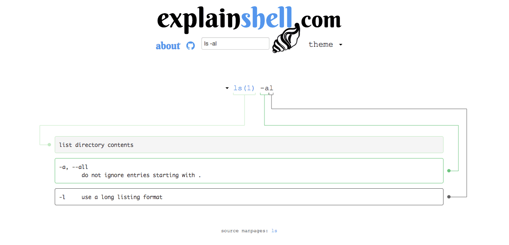

  

---

## シェルスクリプトの文法を解説してくれるサービス「explainshell」

### explainshellとは

ボックス内に入力したスクリプトを、自動的に解析してどんな意味を持ったコードなのかを説明してくれるサービス。  
http://explainshell.com/

シェルスクリプトのサンプル事例などをコピペして、このサービスで意味を把握すると凄く捗ります。

例えば `$ ls -al` を解析するとこんな感じになる

